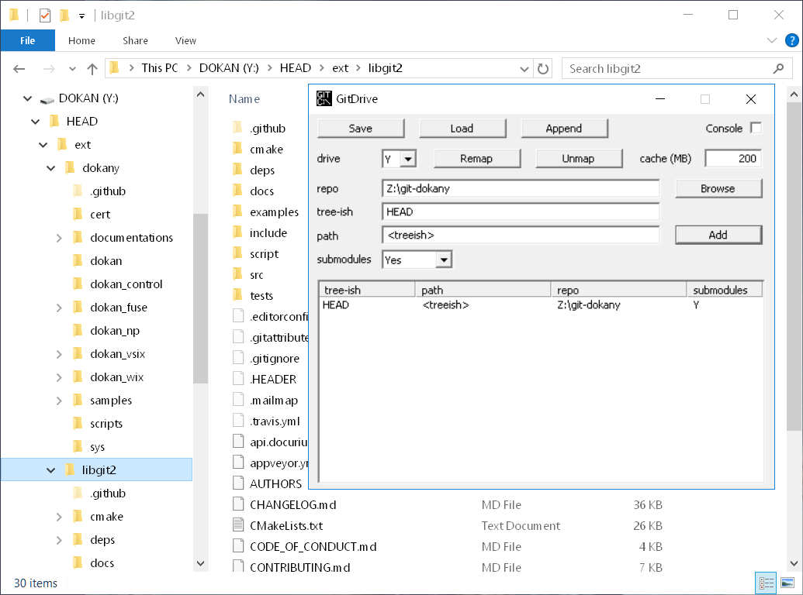

# git-dokany

git-dokany is a filesystem for read only access to git version controlled files.  
git-dokany uses the [Dokany](https://dokan-dev.github.io/) user mode file system library ([github page](https://github.com/dokan-dev/dokany)).  
Git repository access is available using [libgit2](https://libgit2.github.com/) and its dependency libraries.




## Installing (Windows)

First [install](https://github.com/dokan-dev/dokany/wiki/Installation) the Dokany filesystem driver, 64-bit version, 0.8.0 or later.  
The user mode library (dokan1.dll) is not needed.  

Then [download](https://github.com/c-klapaucius/git-dokany/releases) and run git-dokany.exe.  
Type git-dokany.exe --help to display the command line options. Or double click to start in GUI mode as a system tray app.

## Build on Linux
Install libgit2 v0.26.2, then tweak and use the Makefile.  
  
Or use the following commands:

```
cd git-dokany
git submodule update --init ext/libgit2
cd linux
mkdir libgit2_build && cd libgit2_build
../libgit2_cmake.sh
make -j4 install
cd ..
make
cd build
export LD_LIBRARY_PATH=./libgit2/lib
./git-dokany --help
```

## Build on Windows
Checkout libgit2 and Dokany submodules. Build libgit2 and then use the provided visual studio project.  
  
Or use the following steps:

```
cd git-dokany
git submodule update --init ext/dokany
git submodule update --init ext/libgit2
cd win
mkdir libgit2_build
cd libgit2_build
..\libgit2_cmake.cmd
```

This should generate libgit2 visual studio projects. Now open and build the INSTALL projects of the following visual studio solutions:

```
git-dokany\win\libgit2_build\debug\libgit2.sln
git-dokany\win\libgit2_build\release\libgit2.sln
```

Now it should be possible to build git-dokany using the provided solution:

```
git-dokany\win\git-dokany.sln
```
